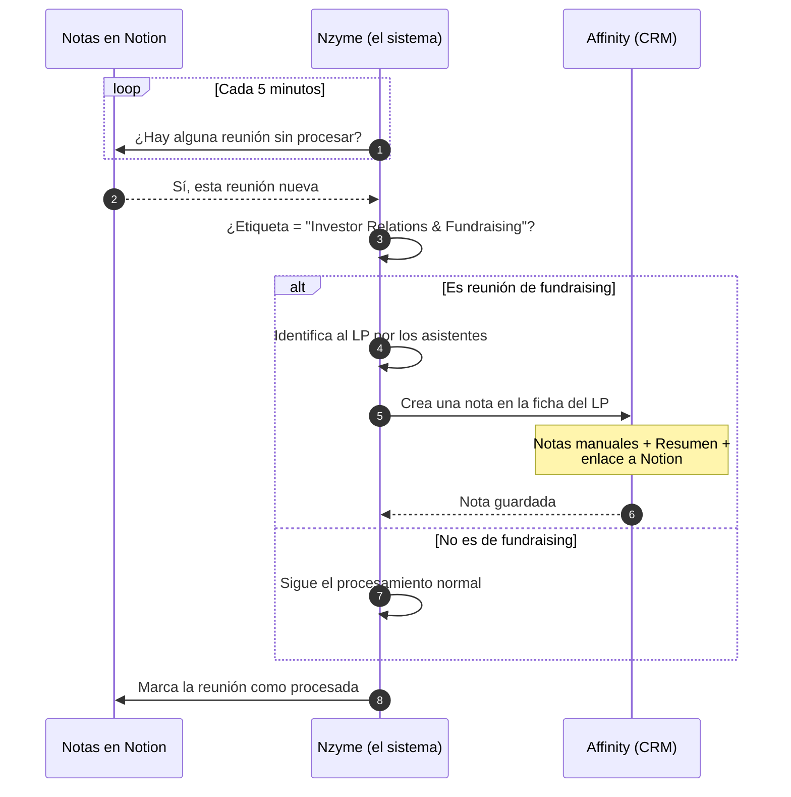

# Correo: cómo Nzyme conecta las notas de reunión con Affinity

> **Nota para Santiago (no va en el correo):** en el código el cron está en `rate(5 minutes)`, no 3. He puesto "cada pocos minutos / cada 5 minutos" para que sea preciso. Cámbialo si prefieres redondear.

---

## Cuerpo del correo

**Asunto:** Cómo Nzyme registra automáticamente las reuniones de fundraising en Affinity

Hola [Nombre],

Te resumo, sin tecnicismos, cómo funciona la parte del sistema que conecta nuestras notas de reunión con Affinity cuando una reunión es de inversores/fundraising. Lo explico desde el principio para que se entienda el flujo completo.

**1. El sistema vigila las reuniones constantemente.**
Cada pocos minutos (en concreto cada 5), el programa revisa nuestras bases de notas de reunión en Notion y se pregunta: *¿hay alguna reunión nueva que aún no haya procesado?*

**2. Si encuentra una sin procesar, la coge y la analiza.**
Cuando aparece una reunión nueva, el sistema la abre y mira su etiqueta de área (el campo **Macro Work Block**). Esa etiqueta es la que decide qué hacer con ella.

**3. Si la reunión está etiquetada como "Investor Relations & Fundraising", se activa la conexión con Affinity.**
Esto es lo importante: cuando una reunión lleva esa etiqueta, además del procesamiento normal, el sistema la registra automáticamente en Affinity. Y lo hace **siempre** que tenga esa etiqueta, aunque la reunión no genere tareas ni tenga apenas notas: el simple hecho de que haya habido una reunión con un LP ya merece quedar registrado en su ficha.

**4. ¿Cómo sabe el sistema a qué LP corresponde la reunión?**
Mira quién asistió (los correos de los asistentes que vienen del Google Calendar) y los cruza con Affinity. Si reconoce a alguien que pertenece a un LP de nuestro funnel, ya tiene la conexión. Si la reunión fue con varios LPs, lo registra en todos ellos. A los socios/partners internos los ignora a propósito para no ensuciar el funnel, pero sí los etiqueta en la nota para que la reunión aparezca también en su timeline.

**5. Qué escribe exactamente en Affinity.**
El sistema crea una **nota** y la adjunta a la oportunidad del LP (y a las personas que asistieron). Esa nota tiene un título limpio y dos secciones:
- **Notas manuales:** lo que escribió la persona en la reunión (quitando la plantilla vacía). Si no escribió nada, pone "No manual notes".
- **Resumen:** el resumen automático que genera Notion de la reunión.

Y al final añade un enlace para abrir la reunión completa en Notion con un clic.

**6. Lo que NO hace.**
No inventa ni resume con IA en este paso (solo copia lo que ya existe), no modifica campos de la ficha del LP, y si no consigue identificar a ningún LP entre los asistentes, simplemente no escribe nada y lo deja anotado en sus registros internos. Tampoco borra nada: solo añade.

En resumen: **cualquier reunión de fundraising que registremos en Notion queda automáticamente reflejada en la ficha del LP correspondiente en Affinity, sin que nadie tenga que copiar y pegar nada.**

Te adjunto un diagrama sencillo del flujo. Cualquier duda, te lo explico encantado.

Un abrazo,
Santiago

---

## Diagrama de secuencia (Mermaid)

Pega este código en [mermaid.live](https://mermaid.live) o en mermaid.ai:

